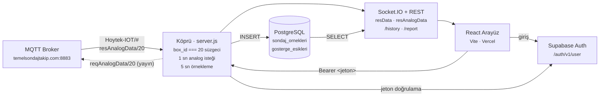

# MTA Sondaj Telemetri Panosu — Sistem Raporu

> Hoytek-IOT MQTT yayınındaki **20 numaralı sondaj makinesinin** canlı verisini izleyen,
> geçmişini PostgreSQL'e yazan ve operasyon raporu üreten iki parçalı sistem:
> bir Node.js köprüsü ile bir React arayüzü.

| | |
| --- | --- |
| Depo | `MTA_Dashboard` |
| İncelenen sürüm | `main` · `1ba8f13` (+ commit'lenmemiş `DataView.jsx` değişikliği) |
| Kaynak | ~7.500 satır / 24 dosya |
| Yığın | React 18 + Vite · Node 20 · PostgreSQL · Supabase Auth |
| Tarih | 21 Ağustos 2026 |

**İçindekiler**

1. [Bir bakışta](#1-bir-bakışta)
2. [Sistem mimarisi](#2-sistem-mimarisi)
3. [Dizin yapısı](#3-dizin-yapısı)
4. [Köprü sunucusu](#4-köprü-sunucusu)
5. [Veri modeli](#5-veri-modeli)
6. [Arayüz](#6-arayüz)
7. [Rapor hesapları](#7-rapor-hesapları)
8. [Kimlik ve güvenlik](#8-kimlik-ve-güvenlik)
9. [Yapılandırma](#9-yapılandırma)
10. [Dağıtım](#10-dağıtım)
11. [Bulgular](#11-bulgular)

---

## 1. Bir bakışta

Sahadaki sondaj makinesi, üzerindeki Hoytek-IOT kutusu aracılığıyla basınç, motor ve konum
verilerini bir MQTT broker'ına yayınlıyor. Tarayıcılar TLS üzerinden native MQTT (8883)
konuşamadığı için araya bir **köprü süreci** giriyor: broker'a abone olur, yalnızca hedef
makinenin paketlerini süzer, bunları Socket.IO ile tarayıcıya iletir ve aynı anda
PostgreSQL'e örnekler yazar.

Kritik tasarım kararı şu: **kayıt tarayıcıdan bağımsızdır.** Geçmişi yazan taraf köprü
sürecidir; sayfa hiç açılmasa bile köprü ayakta olduğu sürece veri birikmeye devam eder.
Arayüz yalnızca bir tüketicidir.

| | |
| --- | --- |
| **İzlenen cihaz** | `box_id 20` — tek makine; tüm cihazlar aynı topic'e yayın yapar |
| **Kayıt çözünürlüğü** | 5 sn (`HISTORY_SAMPLE_MS`), süresiz saklama |
| **Takip edilen alan** | 34 — 17 makine + 10 motor + 7 dijital/Aux |

### Bileşenler

| Parça | Dosya | Görev | Barındırma |
| --- | --- | --- | --- |
| **Köprü** | `server.js` | MQTT aboneliği, süzme, Socket.IO yayını, Postgres kaydı, rapor uçları, jeton doğrulama | Railway |
| **Arayüz** | `src/` | Giriş ekranı, canlı göstergeler, harita, geçmiş grafik, sondaj makine raporu | Vercel |
| **Veritabanı** | `sql/schema.sql` | Zaman serisi örnekleri + gösterge eşiklerinin sürüm geçmişi | Supabase Postgres |
| **Kimlik** | `src/lib/supabase.js` | E-posta/parola girişi, oturum saklama, jeton yenileme | Supabase Auth |

---

## 2. Sistem mimarisi



Jeton doğrulanmadan ne Socket.IO el sıkışması ne de veri uçları yanıt verir.

### İki ayrı veri akışı

Köprü tek bir akış değil, **iki akış** taşır ve bunlar arayüzde farklı sekmelere gider:

| Akış | Topic | Nasıl gelir | Nereye gider |
| --- | --- | --- | --- |
| `resData` | `Hoytek-IOT/#` | Cihaz kendi kendine yayınlar | Motor + Dijital sekmeleri, Konum, **ve veritabanı** |
| `resAnalogData` | `resAnalogData/20` | Köprü saniyede bir `reqAnalogData/20` ile ister | Yalnızca Makine Verileri sekmesi — **kaydedilmez** |

> **Sonucu:** `AnalogData1..16` değerleri istek/cevap akışından geldiği için geçmiş tabloya
> yazılmaz. Buna rağmen tablo bu sütunları taşır ve Geçmiş Grafik bu alanları listeler;
> pratikte bu seriler boş kalır. Yalnızca ana pakette gelen alanlar (`CAN_*`, `AuxData*`)
> gerçekten geçmişe girer — raporun tüm hesapları da bunların üzerine kuruludur.

---

## 3. Dizin yapısı

```
MTA_Dashboard/
├── server.js                  1033 sat.  Köprü: MQTT + Socket.IO + Postgres + REST
├── index.html                          Vite girişi; tema açılış script'i burada
├── package.json                        npm dev = köprü + arayüz birlikte
├── vite.config.js                      Arayüz portu 5174 (DTS Demo 5173 ile çakışmasın)
├── railway.json                        Köprü dağıtımı: node server.js, /health kontrolü
├── vercel.json                         Arayüz dağıtımı: vite build → dist/
├── .env / .env.example                 Broker, veritabanı, Supabase ayarları
├── README.md                           Kurulum, dağıtım ve alan eşleştirme rehberi
│
├── sql/
│   └── schema.sql              95 sat.  Elle kurulum için şema (köprü zaten otomatik kurar)
│
├── public/                             logo.png · drill-icon-latest.png · menu.jpg · favicon.svg
├── dist/                               Derlenmiş çıktı (git'e girmez)
│
└── src/
    ├── main.jsx                 10 sat.  React kökü
    ├── App.jsx                  44 sat.  Oturum kapısı: oturum yoksa panel hiç takılmaz
    ├── socket.js                36 sat.  Socket.IO istemcisi; autoConnect kapalı
    ├── styles.css             2953 sat.  Tüm görünüm; renkler CSS değişkenlerinden
    │
    ├── config/
    │   ├── fields.js           154 sat.  Tek doğruluk kaynağı: etiket, birim, aralık, eşik
    │   └── themes.js            20 sat.  Sistem / Koyu / Açık mod listesi
    │
    ├── lib/
    │   ├── supabase.js          30 sat.  Auth istemcisi (anon anahtar)
    │   └── api.js               17 sat.  bridgeFetch: her isteğe taze jetonu ekler
    │
    └── components/
        ├── LoginView.jsx       198 sat.  E-posta/parola girişi, Türkçe hata mesajları
        ├── Dashboard.jsx       186 sat.  Üst bar, Veriler/Konum sekmeleri, 15 sn bayatlama
        ├── DataView.jsx        391 sat.  Alt sekmeler, arama, eşik yükleme/kaydetme
        ├── Gauge.jsx           358 sat.  SVG yarım daire gösterge + eşik düzenleme kipi
        ├── StatCard.jsx         55 sat.  Motor özet kartları (Voltaj, Çalışma Saati…)
        ├── DigitalCard.jsx      37 sat.  0/1 durum kutucukları
        ├── HistoryView.jsx     811 sat.  Geçmiş grafik; ApexCharts sarmalayıcısı burada
        ├── ReportView.jsx      517 sat.  Sondaj makine raporu: kartlar, uyarı tablosu, grafik
        ├── OperationView.jsx     9 sat.  Boş iskelet — Operasyon Raporu henüz yazılmadı
        ├── RangePicker.jsx     136 sat.  Ortak tarih aralığı paneli (maks. 7 gün / 30 gün geri)
        ├── LocationView.jsx    116 sat.  Enlem/boylam paneli
        ├── MapView.jsx          81 sat.  Leaflet + Google Hybrid katmanı
        ├── ThemePicker.jsx     138 sat.  Görünüm modu düğmesi
        └── Logo.jsx             90 sat.  logo.png yoksa devreye giren SVG amblem
```

> **Bağımlılık yönü:** `server.js` arayüz klasöründeki `src/config/fields.js` dosyasını
> *içeri aktarır*. Alan listesi tek yerde dursun diye tercih edilmiş; bu yüzden o dosya saf
> veridir, hiçbir React bağımlılığı taşımaz. Yeni bir alan eklendiğinde köprü yeniden
> başlatıldığında veritabanı sütunu da kendiliğinden açılır.

---

## 4. Köprü sunucusu

`server.js` — sistemin tek durmadan çalışan parçası.

### Sorumluluklar

- **MQTT aboneliği.** `Hoytek-IOT/#` ve `resAnalogData/20`. Joker kullanılmasının nedeni
  broker'daki gerçek topic adının sonunda eğik çizgi taşıması (`Hoytek-IOT/`); tam eşleşme
  arayan istemciler hiç mesaj alamıyor.
- **Süzme.** Aynı topic'e onlarca cihaz yayın yapar; `Number(value.box_id) !== boxId` olan
  her paket sessizce düşer.
- **Analog yoklaması.** Bağlantı kurulunca `reqAnalogData/20` topic'ine saniyede bir istek
  yayınlanır (en az 250 ms'e kilitli).
- **Örnekleme.** Paketler saniyede birkaç kez gelebilir; en fazla 5 sn'de bir satır yazılır.
  Yazmalar bir söz kuyruğunda (`sampleWriteQueue`) sıralanır, MQTT dinleyicisi asla beklemez.
- **Son durum belleği.** `lastState` içinde son bağlantı durumu, son `resData` ve son
  `resAnalogData` tutulur; yeni bağlanan tarayıcıya anında gönderilir, böylece ekran boş
  açılmaz.
- **Şema bakımı.** Açılışta tablolar ve eksik sütunlar `IF NOT EXISTS` ile kurulur; ayrıca
  gösterge eşikleri `fields.js`'teki fabrika değerleriyle tohumlanır.

### HTTP uçları

| Uç | Erişim | Ne yapar |
| --- | --- | --- |
| `GET /health` | açık | Broker bağlı mı, hedef cihazdan paket görüldü mü, veritabanı hazır mı, çalışan commit hangisi |
| `GET /gauge-thresholds` | jeton | Yürürlükteki uyarı/kritik eşikler ve gösterge alt-üst sınırları |
| `PUT /gauge-thresholds/:key` | jeton | Eşiği değiştirir. Eski satır kapatılır, yenisi açılır — **geçmiş silinmez**, kimin değiştirdiği yazılır |
| `GET /history` | jeton | Tarih aralığındaki zaman serisi; seyreltme veritabanında yapılır (varsayılan ~1200 nokta) |
| `GET /report` | jeton | Çalışma saati, manevra sayısı, verimli/verimsiz süre, wireline tepe sayısı |
| `GET /report-alerts` | jeton | Kritik eşik aşımı olayları; saklanmaz, her istekte ham örneklerden hesaplanır |

### Socket.IO olayları

| Olay | Yön | İçerik |
| --- | --- | --- |
| `connection-status` | köprü → arayüz | Bağlı mı, broker adresi, topic, hata, `dataSeen` |
| `resData` | köprü → arayüz | Ana paket: `CAN_*`, `AuxData*`, `Vehicle_Location_*` |
| `resAnalogData` | köprü → arayüz | `values[]` dizisi `AnalogData1..16` nesnesine çevrilmiş hâlde |

### Dayanıklılık

Köprü hiçbir arıza durumunda çökmeyecek şekilde yazılmış: veritabanı erişilemez olursa
`dbReady` düşer, canlı izleme etkilenmez ve `/health` sebebi söyler. Havuz hatası yakalanır,
MQTT bağlantısı 3 sn'de bir yeniden denenir, geçersiz JSON gövdeleri sessizce atılır.
`DATABASE_URL` hiç tanımlı değilse geçmiş kaydı baştan kapalıdır ve arayüz bunu açıkça
bildirir.

---

## 5. Veri modeli

### fields.js — tek doğruluk kaynağı

Her alan; Türkçe etiketi, birimi, hangi sekmede görüneceği, nasıl çizileceği
(`gauge` / `stat` / `digital`), hangi pakette geldiği (`source: 'analog' | 'data'`) ve
Normal → Uyarı → Tehlike sınırlarıyla birlikte burada tanımlı. Bir eşiği ya da ismi
değiştirmek için başka hiçbir dosyaya dokunulmaz; veritabanı sütunları da bu listeden
türetilir.

| Grup | Adet | Tür | Örnek alanlar |
| --- | ---: | --- | --- |
| Makine Verileri | 17 | radyal gösterge | Ana Pompa Basıncı, Rotasyon Tork, Wireline Winç, Kule Pitch |
| Motor — özet | 3 | kart | Voltaj, Üretici Kodu, Çalışma Saati |
| Motor — gösterge | 7 | radyal gösterge | Motor Devri, Hararet, Yakıt Seviyesi 1–2 |
| Dijital — gösterge | 1 | radyal gösterge | SPT Vuruş (`AuxData2`) |
| Dijital — durum | 6 | 0/1 kutucuk | Acil Stop, Filtre 1–2, Hidrolik Seviye, Morsed Yağlama |

> **Sekme ≠ kaynak:** Rotasyon Devir (`AuxData1`) Makine Verileri sekmesinde görünür ama
> değeri analog pakette değil ana pakette gelir; ayrıca `divisor: 2` ile ikiye bölünerek
> gösterilir. Alanın kendi `source` bilgisi olduğu için doğru paketten okunur — sekme
> değiştirmek okumayı bozmaz.

### Tablolar

**`sondaj_ornekleri` — 34 sütun.** `zaman TIMESTAMPTZ`, `box_id INTEGER` ve her alan için bir
`DOUBLE PRECISION`. Birincil anahtar `(box_id, zaman)` — hem tekilliği sağlar hem aralık
sorgusunun indeksidir. Süresiz saklanır.

**`gosterge_esikleri` — sürüm geçmişli.** Her eşik değişikliği yeni satır açar; eskisinin
`gecerli_bitis` alanı doldurulur. Kısmi tekil indeks aynı anda yalnızca tek bir aktif satıra
izin verir. `guncelleyen_kullanici` alanına giriş yapan kişinin e-postası yazılır.

Her iki tabloda da **Row Level Security açık** ama politika tanımlı değil. Bu bilinçli:
Supabase `public` şemasındaki tabloları otomatik REST API'ye açtığı için, politikasız RLS bu
erişimi tamamen kapatır. Köprü etkilenmez — tabloyu oluşturan rol sahibi olduğundan RLS'i
atlar.

---

## 6. Arayüz

React 18 + Vite; durum yönetimi kütüphanesi yok, hepsi bileşen içi state.

### Bileşen ağacı

```
App  ← oturum kapısı
│   Supabase oturumu okunur. undefined iken "Oturum denetleniyor…"
│   ekranı gösterilir; oturum yoksa panel React ağacına hiç girmez,
│   dolayısıyla köprüye bağlantı da açılmaz.
│
├── LoginView            oturum yoksa
│
└── Dashboard            oturum varsa
    ├── üst bar: Logo · Cihaz #20 · Aktif/Pasif rozeti · ThemePicker · Çıkış
    ├── sekme: Veriler → DataView
    │   ├── alt sekme: Makine Verileri   → Gauge ×17
    │   ├── alt sekme: Motor Verileri    → StatCard ×3 + Gauge ×7
    │   ├── alt sekme: Dijital Makine V. → Gauge ×1 + DigitalCard ×6
    │   ├── alt sekme: Geçmiş Grafik     → HistoryView (/history)
    │   ├── alt sekme: Sondaj Makine R.  → ReportView (/report + /report-alerts)
    │   └── alt sekme: Operasyon Raporu  → OperationView (boş)
    └── sekme: Konum   → LocationView → MapView (Leaflet)
```

### Canlılık ve bayatlama

`Dashboard` saniyede bir tetiklenen bir sayaç tutar. Son paketin üzerinden **15 saniye**
(`STALE_MS`) geçtiyse tüm değerler *Veri Yok* olur ve üst bardaki rozet *Pasif*'e döner; veri
yeniden akmaya başladığında sayfa yenilenmeden normale döner. İki akış ayrı ayrı izlenir:
Makine Verileri sekmesi analog paketin tazeliğine, diğerleri ana paketinkine bakar.

### Göstergeler

`Gauge.jsx` saf SVG bir yarım daire ibre çizer — harici kütüphane yok. Bölgeler kesintisiz
tek bir yay oluşturur; renkler `--zone-normal/warning/danger` değişkenlerinden gelir. Değer
aralığın dışına çıkarsa ibre uca kilitlenir ve bu durum ayrıca işaretlenir, böylece "gösterge
donmuş" izlenimi sessiz kalmaz.

Her göstergenin üzerinden **uyarı/kritik eşiği ve alt-üst sınırı düzenlenebilir**; kaydedilen
değer `PUT /gauge-thresholds/:key` ile veritabanına gider ve o andan itibaren raporlardaki
kritik olay taraması da yeni eşiğe göre okunur.

### Grafikler

Geçmiş grafik ApexCharts ile çizilir; Türkçe yerel, yakınlaştırma/kaydırma araç çubuğu ve
dışa aktarma menüsü kütüphaneden gelir. Eksen **doğrusaldır** — daha önce logaritmikti, küçük
serileri görünür kılıyordu ama eşit mesafeleri eşit olmayan değer farklarına eşlediği için
yanıltıcıydı. Grafik renkleri bölge renklerinden ayrı bir 24 renklik paletten gelir: burada
renk "durum" değil "hangi alan" demektir. `ReportView` aynı `Chart` bileşenini yeniden
kullanır.

### Tema

Üç mod var: **Sistem**, **Koyu** (varsayılan) ve **Açık**. `system` bir palet değil bir
tercihtir; `<html data-theme>` özniteliğine her zaman çözümlenmiş palet yazılır. Seçim
`index.html` içindeki açılış script'iyle sayfa boyanmadan önce uygulanır, böylece açılışta
renk titremesi olmaz. Mod listesi `themes.js` ile `index.html`'de iki kez geçer ve
**birlikte güncellenmelidir**.

---

## 7. Rapor hesapları

Sistemin en yoğun mantığı burada; hepsi tek bir SQL sorgusunda, Postgres pencere
fonksiyonlarıyla.

Sondaj Makine Raporu sekmesi sekiz özet kartı üretir. Değerlerin hiçbiri önceden hesaplanıp
saklanmaz — her istekte ham örneklerden yeniden türetilir. Bu, aynı aralığın iki kez farklı
sonuç vermesini imkânsız kılar ve bir eşik değiştiğinde geçmişin de anında yeni eşiğe göre
okunmasını sağlar.

### Toplam Çalışma Saati — iki yöntem

**1. Sayaç farkı (varsayılan).** `CAN_Engine_Total_Hours_Of_Operation` kümülatif sayacının
aralık başı ve sonu arasındaki farkı. Sayaç yalnızca motor çalışırken ilerlediği için **kayıt
boşlukları sonucu bozmaz.** Eksiği çözünürlük: sayaç 0,05 saatlik adımlarla arttığından sonuç
±3 dakika oynayabilir.

**2. Kesintisiz çalışma (koşullu).** Kayıtlar pencerenin iki ucuna da yetişiyorsa, arada
boşluk yoksa ve motor devrinin sıfır olduğu tek bir örnek bile yoksa süre doğrudan kayıt
penceresinin uzunluğudur. 3 dakikalık yuvarlama kaybolur. Yalnızca kapsam tamken uygulanır —
boşluk varsa "hiç durmamış" bilgisi güvenilir değildir.

### Diğer metrikler

| Kart | Kaynak alan | Tanım |
| --- | --- | --- |
| Manevra Sayısı | `AuxData1` | Rotasyon devrinin **500 rpm** üstüne çıktığı ayrı blok sayısı. Bir bloğa 5 dakikadan uzun ara verilirse yeni manevra sayılır; kısa veri düşüşleri tek olayı ikiye bölmez. |
| Verimli Çalışma | `AuxData1` | Manevra bloklarının başlangıç–bitiş sürelerinin toplamı. |
| Verimsiz Zaman | — | Seçilen pencere eksi verimli çalışma. |
| İç Tüp Çekme Operasyonu | `AnalogData7` | Wireline basıncının **150 BAR** ve üstüne çıktığı, aralarında 5 dakikadan fazla boşluk bulunan ayrı tepe sayısı. |
| Operasyon Öncesi / Sonrası Süre | `AuxData1` | Manevranın hemen dışındaki, sıfırdan büyük ama 500 rpm altındaki hazırlık/toparlama hareketi. Her örnek en yakın manevraya atanır; 1 dakikadan büyük kayıt boşlukları süreye eklenmez. |
| Uyarılar | tüm göstergeler | Kritik eşiğe çıkan her olay; 60 sn'den kısa aralar tek olay sayılır. Her olay için ulaşılan en yüksek değer ve zamanı verilir, en fazla 1.000 kayıt. |

> **Eksik veriyi gizlememe ilkesi:** Rapor boş bir uyarı listesini "sorun yok" diye sunmaz.
> Aralıkta hiç kayıt yoksa veya kayıt boşluğu varsa bunu ayrıca yazar; kapsam oranı
> (`coverage.ratio`) ayrı bir alan olarak döner. Aynı şekilde eşikler yüklenemediyse tarama
> "uyarı yok" demek yerine 503 döner.

> **Sorgu performansı:** `/report-alerts` eşik karşılaştırmasını iki yerde birden yapar:
> dıştaki `OR` filtresi hiçbir göstergesi kritik olmayan satırları daha örnek tablosu
> okunurken eler, kalan avuç dolusu satır `LATERAL` ile göstergelere açılır. Maliyet toplam
> örnek sayısıyla değil, kritik örnek sayısıyla büyür. Benzer bir özen `/report` içinde de
> var: "sonraki aktif zaman" ilerleyen çerçeve yerine ters sıralı büyüyen çerçeveyle bulunur,
> böylece O(n²) yerine tek geçişte biter.

---

## 8. Kimlik ve güvenlik

Giriş yapmadan hiç kimse paneli ya da canlı veriyi göremez.

### Akış

- Kullanıcı `LoginView`'da e-posta/parola ile Supabase Auth'a giriş yapar. Oturum tarayıcıda
  saklanır ve süresi dolmadan otomatik yenilenir.
- Arayüz köprüye bağlanırken jetonu Socket.IO el sıkışmasında `auth.token` olarak gönderir.
  `autoConnect` kapalıdır — bağlantı yalnızca elde geçerli jeton varken kurulur.
- REST istekleri `bridgeFetch` üzerinden gider; her çağrıda `getSession()` ile **taze** jeton
  okunur, böylece uzun açık kalan sekmeler 401 almaz.
- Köprü jetonu Supabase'in `/auth/v1/user` ucuna sorarak doğrular. JWT imza sırrını tutmaya
  gerek kalmaz; yalnızca genel anon anahtar yeter.
- Doğrulama sonuçları 60 saniye önbelleklenir. Geçersiz jetonlar da 10 saniye hatırlanır —
  kopmuş bir istemci saniyede onlarca deneme yaparsa Supabase yorulmasın diye.

### Savunma katmanları

| Katman | Uygulama |
| --- | --- |
| Arayüz | Oturum yoksa `Dashboard` React ağacına hiç takılmaz |
| WebSocket | `io.use()` ara katmanı geçersiz jetonu el sıkışmasında reddeder |
| REST | `requireAuth` her veri ucunda; yalnızca `/health` açık |
| CORS | `ALLOWED_ORIGIN` ile arayüzün gerçek adresine kilitlenebilir (virgülle çoklu) |
| SQL | Alan adları allow-list'ten geçer; sorgu gövdesine kullanıcı metni girmez, tanımlayıcılar tırnaklanır |
| Veritabanı | Her iki tabloda politikasız RLS — Supabase REST API'sinden erişim tamamen kapalı |

> **Sert davranış:** `SUPABASE_URL` / `SUPABASE_ANON_KEY` köprüde tanımlı değilse kimlik
> doğrulanamayacağı için **tüm bağlantılar reddedilir** — sessizce açık kalmaz. Sunucu bunu
> açılışta konsola yazar.

---

## 9. Yapılandırma

Tüm ayarlar ortam değişkenlerinde; `.env.example` her birini açıklıyor.

| Değişken | Varsayılan | Açıklama |
| --- | --- | --- |
| `MQTT_HOST` / `_PORT` | `temelsondajtakip.com` / `8883` | Broker adresi; 8883 TLS demek |
| `MQTT_TOPIC` | `"Hoytek-IOT/#"` | Tırnak şart — tırnaksız yazılırsa dotenv `#` sonrasını yorum sayar |
| `BOX_ID` | `20` | İzlenen makine; süzgecin tek ölçütü |
| `ANALOG_REQUEST_INTERVAL_MS` | `1000` | Analog yoklama sıklığı (alt sınır 250 ms) |
| `HISTORY_SAMPLE_MS` | `5000` | En sık kaç ms'de bir satır yazılacağı |
| `DATABASE_URL` | — | Boşsa geçmiş kaydı kapalı; canlı izleme etkilenmez |
| `DATABASE_SSL` | `false` | Barındırılan Postgres'lerin çoğu TLS ister |
| `ALLOWED_ORIGIN` | `*` | Prod'da arayüzün gerçek adresi yazılmalı |
| `PORT` / `BRIDGE_PORT` | — / `4001` | Railway `PORT`'u kendisi enjekte eder ve o önceliklidir |
| `SUPABASE_URL` / `_ANON_KEY` | — | Köprünün jeton doğrulaması için; arayüzle aynı proje olmalı |
| `VITE_SUPABASE_URL` / `_ANON_KEY` | — | Arayüzün giriş ekranı için; derleme anında gömülür |
| `VITE_BRIDGE_URL` | `http://localhost:4001` | Derleme anında gömülür; sonradan değişirse yeniden deploy gerekir |

### Yerel çalıştırma

`npm run dev` köprüyü ve arayüzü birlikte başlatır (concurrently). Köprü `:4001`, arayüz
`:5174`. Tek başına çalıştırmak için `npm run server` ya da `npm run ui`. Node 20 gerekir.

---

## 10. Dağıtım

İki parça ayrı yerlerde barınır; nedeni teknik bir zorunluluk.

**Köprü → Railway (sürekli süreç).** MQTT ve WebSocket bağlantısını sürekli açık tutması
gerekir; serverless ortamlarda çalışmaz. `railway.json` `node server.js` ile başlatır,
`/health` ucundan sağlık kontrolü yapar, hata durumunda 10 kez yeniden dener.

**Arayüz → Vercel (statik CDN).** `vite build` çıktısı `dist/` yayınlanır. Tek zorunlu
değişken `VITE_BRIDGE_URL`; tanımlanmazsa arayüz `localhost:4001`'e bağlanmaya çalışır ve
konsola sebebini yazar.

İki adres birbirine tanıtılır: Vercel adresi belli olunca Railway'deki `ALLOWED_ORIGIN` o
adrese çekilir. Vercel'in her dalda ürettiği önizleme adresleri farklı olduğundan,
önizlemelerin de veri görmesi isteniyorsa onlar da virgülle eklenmelidir.

Doğrulama: `https://<ad>.up.railway.app/health` çağrısı `connected: true` ve
`history.ready: true` dönüyorsa köprü ayaktadır. Aynı yanıttaki `commit` alanı çalışan
sürümün commit'ini gösterir — "deploy gerçekten yeni kodu mu aldı" sorusu tahminle değil
bakarak yanıtlanır.

---

## 11. Bulgular

İnceleme sırasında fark edilen tutarsızlıklar. Hiçbiri sistemi durdurmuyor; çoğu belgeleme
kayması.

### İki gösterge aynı etiketi taşıyor · arayüz

`fields.js`'te `CAN_Engine_Oil_Temperature` alanının etiketi *"Motor Yağ Basıncı"* — birimi
`°C` olmasına ve hemen üstündeki `CAN_Engine_Oil_Pressure` ile aynı adı taşımasına rağmen.
Motor Verileri sekmesinde iki gösterge yan yana aynı isimle çiziliyor. Muhtemelen
*"Motor Yağ Sıcaklığı"* olmalı.

### `.env` içinde iki kez `DATABASE_URL` · yapılandırma

33. ve 34. satırlarda iki farklı bağlantı adresi var (biri doğrudan, biri pooler). dotenv son
satırı kullanır, yani etkin olan pooler adresi — ama bu niyet mi kaza mı dosyadan
anlaşılmıyor. Kullanılmayanın yorum satırına alınması karışıklığı önler.

### Commit'lenmemiş değişiklik: Operasyon Raporu açıldı · yapılandırma

`DataView.jsx`'te `OPERATION_VISIBLE` `false`'tan `true`'ya çekilmiş ve henüz commit
edilmemiş. Sekme artık görünüyor ama `OperationView` hâlâ *"henüz hazırlanıyor"* yazan boş
bir iskelet; bir satır üstteki yorum da hâlâ "şimdilik gizli" diyor.

### README'deki mimari şeması yanlış cihaz numarası veriyor · belge

Şemada `box_id === 59` yazıyor; metnin geri kalanı, `.env` ve kod `20` diyor. Eski bir
kopyalamadan kalmış görünüyor.

### README'deki sekme listesi eksik · belge

Listede **Sondaj Makine Raporu** ve **Operasyon Raporu** yok; ayrıca
*"AnalogData12 kullanılmıyor"* deniyor, oysa artık *Su Litre* göstergesi olarak tanımlı.
Üstteki sekmelerin aslında `DataView`'ın alt sekmeleri olduğu da belirtilmemiş — gerçek üst
sekmeler yalnızca *Veriler* ve *Konum*.

### Kod yorumu geçmişin bellekte tutulduğunu söylüyor · belge

`HistoryView.jsx` başındaki yorum *"Geçmiş köprünün belleğinde tutulur… köprü yeniden
başlarsa eski örnekler kaybolur"* diyor. Geçmiş PostgreSQL'e taşındığından beri bu doğru
değil; aynı bileşen içindeki kullanıcıya gösterilen metinlerde de "köprünün elindeki geçmiş"
ifadesi kalmış.

### Analog alanlar geçmişe yazılmıyor ama grafikte listeleniyor · belge

Geçmiş Grafik'in alan seçicisi `AnalogData*` çiplerini gösterir; bu alanlar istek/cevap
akışından geldiği ve kayda girmediği için çipler daima "bu aralıkta veri yok" durumunda
kalır. Davranış doğru çalışıyor (çipler devre dışı), ama nedeni kullanıcıya hiçbir yerde
söylenmiyor.
